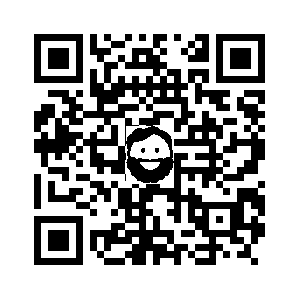

# QRLogo
[](https://godoc.org/github.com/divan/qrlogo)

## Intro
QRLogo is a small library and command line to generate QR images with small logo placed in the center.

Thanks to redundancy in the QE codes nature, code remains readable even if part of its covered by image, i.e. logo. It allows to create nice branded-like QR codes.



## Install
To install command line tool:

```go get github.com/divan/qrlogo/cmd/qrlogo```

Or only lib (basically, the same, but without installing binary):

```go get github.com/divan/qrlogo```

## Usage
### Command line tool
For command line tool, it's enough to specify input image (i.e. logo) and text or URL to be encoded:

```qrlogo -i logo.png http://githib.com/divan/qrlogo```

Output will be written to qr.png file in PNG format.

You can also specify output filename and image size (512px by default). See `-help` output for details.

Also there is an option to enable color

Note, that resizing logo image is up to you, it will be placed on top of resulting QR code without resizing or guessing proportions.

### Library
For the library, usually it's enough to call only `qrlogo.Encode()` function, but if you need more precise controls, create new `qrlogo.Encoder` and set the values you need. See [Documentation](https://godoc.org/github.com/divan/qrlogo) for more details.

## License
MIT

